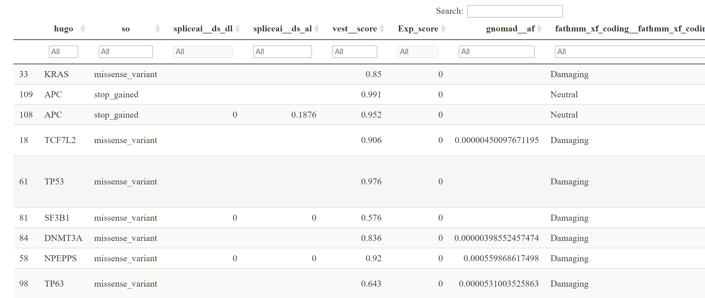

# Simple. Variant Ranking Annotation CAncer Score

#### Efstathios-Iason Vlachavas
###### DKFZ-Division of Molecular Genome Analysis (B050)
###### Efstathios-Iason.Vlachavas@dkfz-heidelberg.de

[](https://doi.org/10.5281/zenodo.5636747)

## Description

The main goal of the developing a ranking scheme in translational cancer research, is to aid the biological interpretation of lists of annotated cancer variants at the single patient resolution. Briefly, taking into account different annotation resources, such as variant effect prediction, cancer evidence, expression and systems biology properties, an integrated scoring value is assigned to each variant as a *hollistic* score, ranking variants from a single patient mutations list. In addition, the first version of the scoring process is based on single nucleotide changes that occur in the protein-coding space; that is, somatic mutations that can lead to several possible changes to a protein. Overall, the main rationale is despite the fact that a significant number of variant annotation tools in cancer research are available for a robust exploitation of putative somatic variants, no direct score or assessment is available for a simple ranking or prioritization of the interrogated variants, based on the plethora of distinct evidence. 

The ranking score is based on the output of the OpenCRAVAT annotation platform (https://doi.org/10.1200/cci.19.00132) and can serve as an additional *plug-in*, aiding in the interpretation of the annotated variant calling results. The open-source OpenCRAVAT toolkit possesses significant and important features, by making it possible to integrate multiple sources of evidence for variant annotation and exploitation.

In addition, for the construction and the relative score cut-offs, various guidelines and publications were considered for estimating the oncogenicity of somatic mutations, based on big consortia, such as:

1. [Belgian ComPerMed Expert Panel](https://doi.org/10.3390/cancers11122030) 

2. [Variant Interpretation for Cancer Consortium (VICC)](https://cancervariants.org/research/standards/onc_path_sop/)

3. [Review on pathogenicity predictors](https://dx.doi.org/10.1371%2Fjournal.pcbi.1006481)


## Implementation

1. The user has to initially run OpenCRAVAT web server (https://run.opencravat.org/) or install locally (https://open-cravat.readthedocs.io/en/latest/quickstart.html). The input can be a vcf file, or a txt with necessary columns (https://open-cravat.readthedocs.io/en/latest/File-Formats.html)

2. The following annotators should run: gnomAD, ClinVar, CIViC, Mutation Assessor, FATHMM XF Coding, VEST4, SpliceAI, COSMIC, CScape Coding, Cancer Gene Census,
Cancer Gene Landscape, Cancer Hotspots, SiPhy and Phast Cons (15 annotators if having hg19 as the reference genome, to also include **hg19 coordinates**).

3. Next, an RData file has to be created either from the download section of the web server, or locally using the installed version of OpenCRAVAT

```python
oc report example_input.sqlite -t rdata

```

For more details see [here](https://open-cravat.readthedocs.io/en/latest/Reporter.html#example)

4. Finally, after creating the necessary RData file including the variants from one patient/sample, the main function in R to run:

```r
ranked_snvs = predict_sysSVM2(rdata_dir,exp.genes=NULL)

```

## Dependencies

```r
install.packages(c("DT","tidyverse","jsonlite"))

```

## Reproducible example

Here we present a simple example using the mutations from a randomly selected colorectal cancer patient sample ("crc4") from published Reiter et al., 2018 study (https://doi.org/10.1126/science.aat7171), mainly utilizing the Kim et al., 2015 publication (https://clincancerres.aacrjournals.org/content/21/19/4461#:~:text=10.1158/1078-0432.CCR-14-2413). Then, the web version of OpenCRAVAT was used to perform integrative variant annotation using the 15 aforementioned annotators, and the relative RData file was created. Below, a snapshot of the created html file with the top 10 hits are depicted:



```r
sessionInfo()

R version 4.0.3 (2020-10-10)
Platform: x86_64-w64-mingw32/x64 (64-bit)
Running under: Windows 10 x64 (build 18363)

Matrix products: default

locale:
[1] LC_COLLATE=English_United States.1252  LC_CTYPE=English_United States.1252   
[3] LC_MONETARY=English_United States.1252 LC_NUMERIC=C                          
[5] LC_TIME=English_United States.1252    

attached base packages:
[1] stats     graphics  grDevices utils     datasets  methods   base     

other attached packages:
 [1] htmlwidgets_1.5.3 DT_0.18           jsonlite_1.7.2    forcats_0.5.1     stringr_1.4.0    
 [6] dplyr_1.0.6       purrr_0.3.4       readr_1.4.0       tidyr_1.1.3       tibble_3.1.2     
[11] ggplot2_3.3.4     tidyverse_1.3.1

```

## Utilization feedback

For any questions, suggestions or issues please directly use my email or the github issue page 

## Acknowledgements

Stefan Wiemann

Kym Pagel

Rick Kim

Olga Papadodima
